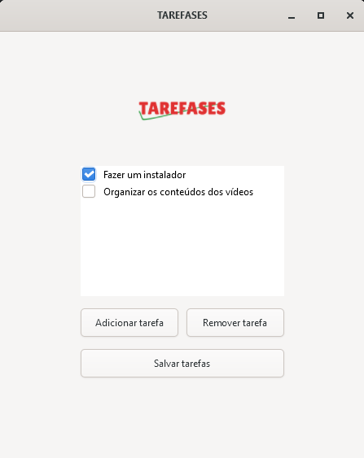

# TAREFASES



Um programa de tarefas em C, com o intuito de demonstrar algumas funcionalidades básicas da biblioteca GTK

# Como compilar

Em produção

# Estrutura do código
```
src/
|--- cli/
|    |--- cli.c            # telas para execução no terminal
|    |--- cli.h
|    |--- cli_utils.c      # funções de utilidade para execução no terminal
|    |--- cli_uils.h
|--- gui/
|    |--- gui.c            # telas da interface gráfica
|    |--- gui.h
|    |--- gui_callbacks.c  # implementações das funções callback
|    |--- gui_callbacks.h
|--- main.c                # ponto de entrada do programa
|--- tarefas_funcs.c       # lógica interna das tarefas
|--- tarefas_funcs.h
CMakeLists.txt             # Arquivo CMake para compilação do projeto
```
